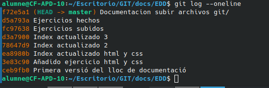

# Paso a paso de como subir archivos y modificaciones a github

1. * Git. Exercici 1. Modifica el fitxer, comprova l'estat i fa l'add i el commit.
alumne@CF-APD-10:~$ git status
fatal: no es un repositorio git (ni ningún padre en el punto de montaje /)
Parando a la frontera del sistema de archivos (GIT_DISCOVERY_ACROSS_FILESYSTEM no establecido).
alumne@CF-APD-10:~$ cd Escritorio/
alumne@CF-APD-10:~/Escritorio$ cd GIT/
alumne@CF-APD-10:~/Escritorio/GIT$ git status
En la rama master
Cambios a ser confirmados:
  (usa "git restore --staged <archivo>..." para sacar del área de stage)
        nuevos archivos: Diari-de-classe

Cambios no rastreados para el commit:
  (usa "git add/rm <archivo>..." para actualizar a lo que se le va a hacer commit)
  (usa "git restore <archivo>..." para descartar los cambios en el directorio de trabajo)
        borrados:        Diari-de-classe

Archivos sin seguimiento:
  (usa "git add <archivo>..." para incluirlo a lo que será confirmado)
        docs/EDD/Documentacion subir archivos git/

alumne@CF-APD-10:~/Escritorio/GIT$ ls
docs  mkdocs.yml
alumne@CF-APD-10:~/Escritorio/GIT$ cd docs
alumne@CF-APD-10:~/Escritorio/GIT/docs$ ls
EDD  index.md  LMI  overrides
alumne@CF-APD-10:~/Escritorio/GIT/docs$ cd EDD
alumne@CF-APD-10:~/Escritorio/GIT/docs/EDD$ ls
'Actividades sobre Ant y Maven'  'ActividadesMkdocs y publicación en Github'   Document_1.md   Document_2.md   Document_3.md   Document_4.md   Document_5.md   Document_6.md  'Documentacion subir archivos git'
alumne@CF-APD-10:~/Escritorio/GIT/docs/EDD$ git add Documentacion\ subir\ archivos\ git/
alumne@CF-APD-10:~/Escritorio/GIT/docs/EDD$ git status
En la rama master
Cambios a ser confirmados:
  (usa "git restore --staged <archivo>..." para sacar del área de stage)
        nuevos archivos: ../../Diari-de-classe
        nuevos archivos: Documentacion subir archivos git/git.md

Cambios no rastreados para el commit:
  (usa "git add/rm <archivo>..." para actualizar a lo que se le va a hacer commit)
  (usa "git restore <archivo>..." para descartar los cambios en el directorio de trabajo)
        borrados:        ../../Diari-de-classe

alumne@CF-APD-10:~/Escritorio/GIT/docs/EDD$ git commit -m "Documentacion subir archivos git"/
[master f72e5a1] Documentacion subir archivos git/
 2 files changed, 1 insertion(+)
 create mode 160000 Diari-de-classe
 create mode 100644 docs/EDD/Documentacion subir archivos git/git.md

alumne@CF-APD-10:~/Escritorio/GIT/docs/EDD$ git log
commit f72e5a11660470064e030a7f7af757ace2afe7d0 (HEAD -> master)
Author: EricMinana <erimincot@alu.edu.gva.es>
Date:   Mon Dec 16 09:45:31 2024 +0100

    Documentacion subir archivos git/

commit d5a793ac33936a7288fd10cd2673500db8bcf1d0
Author: EricMinana <erimincot@alu.edu.gva.es>
Date:   Sun Dec 8 19:49:11 2024 +0100

    Ejercicios hechos

commit fc976382e0e06d6e37ce95a132008f0a6351e66e
Author: EricMinana <erimincot@alu.edu.gva.es>
Date:   Sun Dec 8 18:31:34 2024 +0100

    Ejercicios subidos

commit d3a7900bd750ffe18f6e68729fb118bd0680c083
Author: EricMinana <erimincot@alu.edu.gva.es>
Date:   Sun Dec 8 18:05:09 2024 +0100

    Index actualizado 3

commit 78647d91f7fe56a03f835b0e24137042a0a8ffc0
Author: EricMinana <erimincot@alu.edu.gva.es>
Date:   Sun Dec 8 18:02:38 2024 +0100

    Index actualizado 2

commit ea8980b9ff0535a3b3a5a4f7d9eefdda715c8b14
Author: EricMinana <erimincot@alu.edu.gva.es>
Date:   Sun Dec 8 18:00:21 2024 +0100

    Index actualizado html y css

commit 3e83c906d0a2a3dd294b676eec94aeb615837474
Author: EricMinana <erimincot@alu.edu.gva.es>
Date:   Sun Dec 8 17:57:37 2024 +0100

    Añadido ejercicio html y css

commit ceb9fb01bc934ff738e3c3eaa7dbd7b7db921d85
Author: EricMinana <erimincot@alu.edu.gva.es>
Date:   Mon Nov 11 09:20:51 2024 +0100

